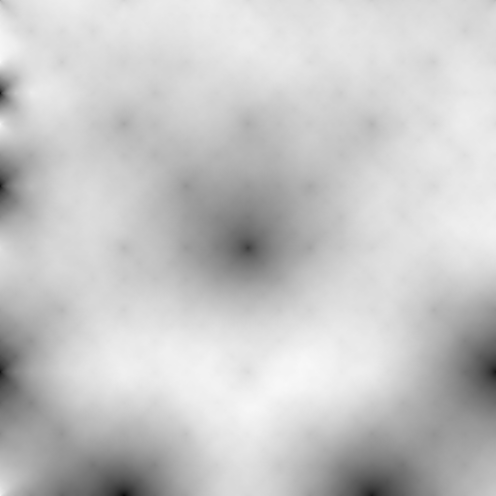

Title: Terrain Generation with OpenCV
Date: 2019-02-18 8:39 
Category: Open Source Projects
Slug: Terrain
Authors: David Jorna


*A simple robot in Gazebo with a procedurally generater heightmap.*



*A png of a heightmap generated in OpenCV.*

## Motivation

  Some of the latest robotics research uses deep reinforcement learning (DRL) to train robots to perform complex tasks. This is the same algorithm used by DeepMind's AlphaGo to beat grandmaster Go players. DRL is great, because it saves robotics engineers from having to hard-code multiple different behaviors, which becomes intractible for robots with many degrees of freedom.

  However, one of the main challenges of applying DRL to robotics is that it requires considerable time to practice. We need a way to reset the work environment when the robot makes a mistake. Also, the initial movements of the untrained robot may be overtorque the motors.

  The solution is simple. Simulation! If we train the robot in a simulation first, we have complete control over the environment, and avoid the risk of damaging our real robot. Most importantly, we can train our robot at faster real-time speed. 


*"Chicken coup?? Those are procedually generated clouds, Beth." - Rick Sanchez*


## Setting up the work environment
To run the code, you'll first need a C++ and an installation of OpenCV. OpenCV can be a bit of a pain to install for the first time. I recommend these tutorials for getting up and running quickly:  
[Windows](https://www.learnopencv.com/install-opencv3-on-windows/)  
[Mac](https://www.learnopencv.com/install-opencv3-on-macos/)  
[Ubuntu](http://www.codebind.com/cpp-tutorial/install-opencv-ubuntu-cpp/)

## The Algorithm
The algorithm for terrain generation that we're going to use is called the [diamond-square algorithm](https://en.wikipedia.org/wiki/Diamond-square_algorithm). It's a fairly simple algorithm that consists of alternately performing "square" and "diamond" operations on a 2D grid. These steps are best explained graphically.


*A graphical illustration of the diamond-square algorithm. Photo credit: Christopher Ewin, <a href="https://creativecommons.org/licenses/by-sa/4.0" title="Creative Commons Attribution-Share Alike 4.0">CC BY-SA 4.0</a>, <a href="https://commons.wikimedia.org/w/index.php?curid=42510593">Link</a>*

## The Code
It seems logical to divide the code into separate the implementation into two separate functions: one for the "square" step, and one for the "diamond step." Let's start with the "square" step first.

### Square Step
In order to implement the square step, we have to consider the four possible locations from which to take the average. On corners and edges, some of the indices will be outside the bounds of the image, so we will have to check this for all four indices.

```C++
void TerrainGenerator::applySquare(int row, int col, int k, cv::Mat& img, float p)
{
  int step = k/2;
  float result = 0;
  float i = 0;
  if (col - step > 0){
    result += img.at<uchar>(row, col - step);
    ++i;
  }
  if (col + step < img.cols) {
    result += img.at<uchar>(row, col + step);
    ++i;
  }
  if (row - step > 0) { 
    result += img.at<uchar>(row - step, col);
    ++i;
  }
  if (row + step < img.rows) {
    result += img.at<uchar>(row + step, col);
    ++i;
  }
  result /= i;
  result += randInt() * p;
  img.at<uchar>(row, col) = result;
}
```

Now we repeat this operation for the entire image.

```C++
void TerrainGenerator::square(int k, cv::Mat& img, float p) 
{
  int stride = k - 1;

  for (int i = k / 2; i < img.rows; i += stride)
    for (int j = 0; j < img.cols; j += stride)
      applySquare<uchar>(i, j, k, img, p);

  for (int i = 0; i < img.rows; i += stride)
    for (int j = k / 2; j < img.cols; j += stride)
      applySquare<uchar>(i, j, k, img, p);
}
```

### Diamond Step
Next is the diamond step. This step is slightly more straightforward because we know that the corners of the diamond will always be inside the image.


```C++
void TerrainGenerator::applyDiamond(int row, int col, int k, cv::Mat& img, float p)
{
  int step = k/2;
  float result = 0;
  result = img.at<uchar>(row - step, col - step)
         + img.at<uchar>(row + step, col - step)
         + img.at<uchar>(row - step, col + step)
         + img.at<uchar>(row + step, col + step);
  result /= 4;
  result += randInt() * p;
  img.at<uchar>(row, col) = result;
}
```

Just like with the square step, we have to apply the diamond stop across the entire image:


```C++
void TerrainGenerator::diamond(int k, cv::Mat& img, float p)
{
  int stride = k - 1;

  for (int i = k / 2; i < img.rows; i += stride) {
    for (int j = k / 2; j < img.cols; j += stride) {
      applyDiamond<uchar>(i, j, k, img, p);
    }
  }
}
```

You can find the full source code on [my Github page](https://github.com/djorna/terrain-generation).


## Next steps
The diamond-square algorithm is a single useful algorithm which could be aa part of a more complex program for procedural generation of simulated worlds. What's missing is simulated terrain erosion, realistic textures, vegetation, and countless other detail that would bridge the gap between our humble heightmap and the real world.

Recently, Nvidia demonstrated the use of GANS (Generative Adversarial Neural Networks) to generate realistic images from little more than blobs of colour. Prehaps a similar technique could be used in the future to create realistic 3D landscapes, which could be used as a training ground for the self-driving cars and drones of the future! Only time will tell.