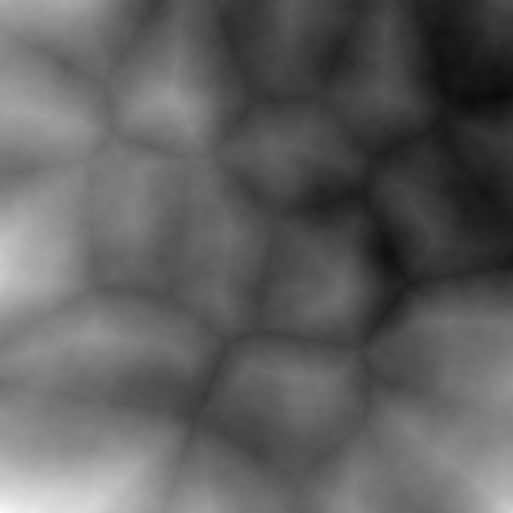

Title: Procedural Terrain Generation
Date: 2019-05-14 9:32 
Modified: 2019-06-14 21:00
Category: Open Source Projects
Tags: Game Development, Projects, Terrain Generation
Slug: Terrain1
Authors: David Jorna
Summary: Generate a 2D heightmap for use in 3D games and simulations.
Featured_Image: /images/thermal_erosion_eroded.png


## Motivation

 Procedural terrain generation encompasses a broad range of techniques, with the goal of efficiently creating a realistic simulated environment. Some of the most famous applications of procedural terrain generation are in [Minecraft](https://www.minecraft.net/en-us/), which procedurally generated biomes to simulate different climages, and [No Man's Sky](https://www.nomanssky.com/), which uses procedural techniques to generate entire worlds.

While video games are the most well-known application of procedural terrain generation, they are not the only application. Recently, OpenAI has demonstrated the utility of training robots in a simulation before deploying them in the real world, using deep reinforcement learning. So far, the focus has mostly been on teaching robotic manipulators complex tasks, but the same algorithms could also be used to train self-driving cars, and other forms of mobile robots. The challenge with this approach is that we have to build hundreds of kilometers of photorealistic roads for the cars to drive on. Perhaps in the future, some kind of procedural world generation will be used to train and test self-driving cars and other robots.


<!--
## Contents
[Diamond-Square Algorithm](#the-diamond-square-algorithm) 
[Voronoi Diagrams](#voronoi-diagrams)  
[Weighted Combination](#weighted-combination)  
[Thermal Erosion](#thermal-erosion)  
[Hydraulic Erosion](#hydraulic-erosion)  
[Unity Plugin Demo](#unity-plugin)  
[Further Reading](#further-reading)
-->

## The Diamond-Square Algorithm
The algorithm for terrain generation that we're going to use is called the [diamond-square algorithm](https://en.wikipedia.org/wiki/Diamond-square_algorithm). It's a fairly simple algorithm that consists of alternately performing "square" and "diamond" operations on a 2D grid. These steps are best explained graphically.


*A graphical illustration of the diamond-square algorithm. Photo credit: Christopher Ewin, <a href="https://creativecommons.org/licenses/by-sa/4.0" title="Creative Commons Attribution-Share Alike 4.0">CC BY-SA 4.0</a>, <a href="https://commons.wikimedia.org/w/index.php?curid=42510593">Link</a>*

The algorithm looks something like this:  

1. Set persistence between 0 and 1
2. Set corners to random values
3. Set the offset range to 1.
4. (Diamond step) Set the center of the diamond to the average of the diamond corner values, plus a random offset within the offset range.
5. (Square step) Set the center of the square to the average of the square corner values, plus a random offset within the offset range.
6. Halve the step size of the diamonds and squares.
7. Multiply the offset range by the persistence.
8. Repeat steps 4->7 until every cell value has been calculated.

Higher values of the "persistence" parameter make the output more noisy, and lower values make it smoother. This make sense, because for lower persistence values, the cell values depend on each other more.


## Voronoi Diagrams

Voronoi diagrams are 2D maps split into polygonal regions based on their proximity to random points. They are easiest to understand with visuals.


*An illustration of a Voronoi diagram with cell regions coloured based on their nearest neighbour.*

Voronoi diagrams have many interesting applications, including urban planning, robotics, and of course procedural generation. There are some interesting algorithms for generating Voronoi diagrams, but we won't be using them, because they mostly focus on calculating the edges of the diagram, which is not the information we're looking for. Instead, we need the 

For this application, we want to adjust the height of each cell based on their \\(n^{th}\\) nearest neighbours. In this case it makes sense to use the kd-tree data structure to allow for fast searching of nearest neighbours.

The heights of each cell will be calculated as a linear combination of its nearest neighbours \\(h = c_1 h_1 + c_2 h_2 ... + c_n h_n\\), where \\(h_i\\) is the \\(n^{th}\\) nearest neighbour and the coefficients \\(c_i\\) are parameters which can be adjusted to achieve different effects.

  
*Generated Voronoi diagram with the parameters \\(n_{peaks} = 20, c_1 = -1, c_2 = 1\\).*

### Modifications
Since the Voronoi diagrams are based on random points, the user has very little control over it, and... 


## Weighted Combination

The Voronoi diagram can be used to simulate mountains, but they are too smooth to emulate real terrain. To remedy this, we will set the new terrain \\(C\\) to be a linear combination of the diamond-square heightmap, \\(D\\), and the Voronoi heightmap, \\(V\\). The parameter \\(\alpha \\) is some real number between 0 and 1.


\\[\renewcommand{\vec}[1]{\mathbf{#1}}\\]
\\[\vec{C} := \\alpha \vec{D} + (1 - \\alpha) \vec{V}\\]
Here's what the heightmap looks like with \\(\alpha\\ = 0.66\\), meaning the ratio of the diamond-square heightmap to the Voronoi heightmap is 2:1:


*Combined heightmap with \\(\alpha = 0.66\\).*

## Perturbation Filter

This one was a pain in the neck to figure out. The algorithm wasn't given in the paper, and instead a link to a textbook *[(Texturing and Modeling: a Procedural Approach Third Edition)](https://www.amazon.com/Texturing-Modeling-Third-Procedural-Approach/dp/1558608486)* was given. So I found the excerpt from the book on Google Books, and it used a shader language (Renderman Shader Language), which I wasn't familiar with. But after banging my head against the desk a bit, I was able to get something that has some resemblance to the figure in the paper.

The "perturbation filter" described in this paper uses a well-known algorithm in procedural generation: [Perlin noise](https://en.wikipedia.org/wiki/Perlin_noise). Perlin noise works by generating an n-dimensional displacement field, so each cell is displaced by a random amount. For this application, we will use 3D Perlin noise, and calculate the displacement of each pixel based on its initial position \\( (i, j) \\), and pixel value \\(h_{i,j}\\).


*The combined heightmap is warped with a perturbation filter with a magnitude of 0.02. This mean that the most any pixel can be displaced in \\(0.02 N\\), where \\(N\\) is the side length of the heightmap.*

## Thermal Erosion

Something to keep in mind with erosion algorithms is that the goal is not necessarily to simulate natural processes. We just want the end result to look right, and the algorithm to be efficient. In computer graphics, there is no such thing as cheating.

<!--
The pseudocode for thermal erosion is as follows:
```Python
c = 0.5 # Erosion magnitude
d_total = 0 # Total height difference
d_max = 0 # Max height difference
T = 4 / N # Talus angle threshold
for n iterations:
    for h in heightmap:
        d = []
        # Neighbours are the 8 adjacent cells (Moore neighbourhood)
        for i in h.neighbours:
            d[i] = h - h[i]
            if d[i] > T:
                d_total += d
                d_max = max(d, d_total)

        for i in h.neighbours:
            # Only erode if difference is above threshold
            if d[i] > T:
                h[i] += c * (d[i] - T)
```
-->

\\[h_i := h_i + c (d_{max} - T) \times \frac{d_i}{d_{total}} , \enspace   \forall d_i > T\\]

Where:  
\\(T\\) is the talus angle parameter, which represents the point at which ...  
\\(c\\) is the erosion magnitude. 
\\(h_i\\) is the \\(i^{th}\\) neighbour of \\(h\\)  
\\(d_i = h - h_i \\) is the height difference between the 
\\(d_{total} = \sum\limits_{i} d_i \quad  \forall d_i > T \\)  

  
*Thermal erosion run for 50 iterations.*

## Hydraulic Erosion

Hydraulic erosion is more demanding on both memory and computation than thermal erosion, because it involves keeping track of a water layer as well as the sediment layer. Hydraulic erosion consists of 4 steps:


### 1. Rainfall

Add a constant value to each cell of the watermap to simulate rainfall.

\\[\vec{W} := \vec{W} + K_{r} \\]

Where \\(\vec{W}\\) is the watermap and \\(K_r\\) is the rain constant.
### 3. Erosion

\\[\vec{H} := \vec{H} - K_{s} \vec{W} \\]
\\[\vec{S} := \vec{S} + K_{s} \vec{W} \\]

Where \\(H\\) is the heightmap, \\(S\\) is the sediment map, and \\(K_s\\) is the sediment coefficient.
### 4. Transportation

Water tends to In mathematical terms, this mean that at each cell, the total value of \\(a = h + w\\) should be levelled out with respect to its neighbours. This gives us the formulas:

\\[\Delta w_i = min(w, \Delta a) \times \frac{d_i}{d_{total}} \\]

Where \\( \Delta w_i\\) is the amount for water transferred from \\(w\\) to each neighbouring cell \\(w_i\\).

And since the flow of water will have an effect on the loose sediment, the sediment flow will be proportional to the water flow:

\\[\Delta s_i = s \times \frac{\Delta w_i}{w} \\]

Where \\( \Delta s_i\\) is the amount for sediment transferred from \\(s\\) to each neighbouring cell \\(s_i\\).

### 5. Evaporation

First, a percentage of the water is evaporated.
\\[\vec{W} := (1 - K_e) \vec{W}  \\]
Where \\(K_e\\) is the evaporation coefficient.

Finally, some amount of sediment, \\(\delta s_{max}\\) will remain within the water, based on the sediment capacity of the water \\(K_s\\), and some will fall, and be recombined with the heightmap. \\(\delta s_{max}\\) is calculated as:  
\\[\delta s_{max} = K_c \times w\\]

And the remaining sediment is recombined with the heightmap:

\\[\Delta s := max(0, s - \delta m_{max})\\]
\\[s := s - \Delta s\\]
\\[h := h + \Delta s\\]


The coefficients used in the paper are as follows:  

\\(K_r = 0.01\\)  
\\(K_s = 0.01\\)  
\\(K_e = 0.5\\)  
\\(K_c = 0.01\\)


## Unity Plugin
In order to visualize the generated terrain in 3D, and provide a simpler user interface, I wrote a Unity3D plugin for the library. I plan to put it on the Asset Store eventually, but for now here are some visualizations of the plugin's functionality.

  
*This animation shows the result of the diamond square algorithm being run with varying values of \\(p\\). As persistence increases, the heightmap looks noisier.*

  
*The Voronoi diagram is generated with parameters \\(n_{peaks}\\), and style coefficients \\(c_1 ... c_n\\). Individual modification of each peak is possible with the addition of multipliers for each individual peak.*


  
*The Voronoi coefficients \\(c_1 ... c_n\\), can be modified to create different effects. The parameters shown here are, in order: \\( (c_1 = -1, c_2 = 1 )\\) (the standard parameters used in the paper to create mountains), \\( (c_1 = 1) \\), \\( (c_1 = 0, c_2 = 1) \\), and  \\( (c_1 = 0, c_2 = 0, c_3 = 1) \\).*

  
*The diamond-square heightmap is combined with the Voronoi heightmap using a heighted average. The gif shows the results of adjusting the weight parameter \\(\\alpha\\). The value of the heightmap is \\(\\alpha D + (1 - \\alpha) V\\) where \\(D\\) and \\(V\\) are the diamond-square and Voronoi heightmaps, respectively.*

  
*[Simplex noise](https://en.wikipedia.org/wiki/Simplex_noise) is used to create a gradient field, which distorts the heightmap, making it less uniform and boxy.*

  
*A demonstration of Jacob Olsen's speed-optimized version of thermal erosion.*

You can find the full source code for this project on [my Github page](https://github.com/djorna/terrain-generation).

## Further Reading
All of the techniques I am using for procedural terrain generation are from a [2004 paper](http://web.mit.edu/cesium/Public/terrain.pdf), which details the use of the algorithm to generate maps for a real-time strategy game. I highly recommend reading the paper, as it goes into more depth about the design and optimization of each of the algorithms.